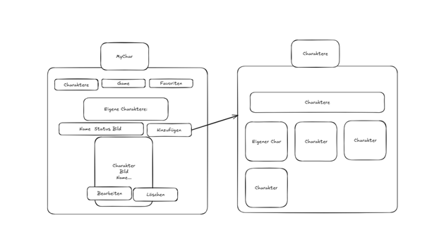
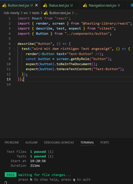
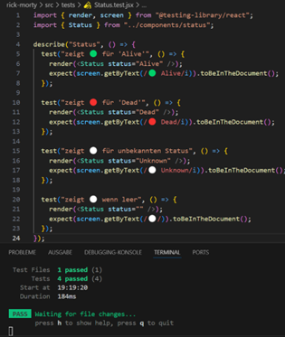
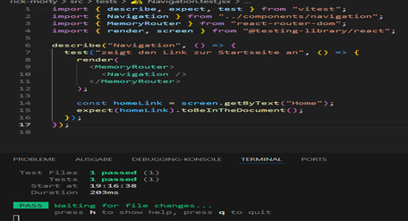

# React-Projektarbeit-Rick-Morty-Game
Ein interaktives Charakter-Game mit Favoritenfunktion, inspiriert vom Rick &amp; Morty Universum

# Projektübersicht

Dieses React-Projekt ist eine interaktive Webapp, in welcher Fans der Kultserie «Rick & Morty» einen Überblick auf alle Charaktere der Serie haben, ein interaktives Spiel, um ihre Lieblingscharaktere auszuwählen und eine Auflistung ihrer Favoriten bietet. Ziel war es React-Komponenten, Routing, CRUD-Funktionalitäten und die Anbindung an externe APIs praxisnah anzuwenden.

---

## Anforderungskatalog

### Technologien & Tools:
• React: Für den Aufbau der Benutzeroberfläche mit wiederverwendbaren Komponenten  
• React Router: Für die Navigation und das Routing zwischen den Seiten (Home, Charaktere, Game, Favoriten, Impressum)  
• CSS: Für das Styling der Anwendung und der Navigation (Abstand, Fixierung, Buttons hervorheben)  
• Fetch API / REST API: Um Daten von der Rick & Morty API abzurufen und anzuzeigen  
• Git & GitHub: Versionskontrolle und Hosting des Projekts im Repository  
• Visual Studio Code: Entwicklungsumgebung für Coding, Testing und Git-Integration  
• Excalidraw: Für Storyboard und Scribble  

---

## User Stories:

### User Story 1:  
Als Benutzer der Rick & Morty App, will ich einen Überblick über alle Rick & Morty Charaktere haben, um zu sehen, ob sie noch am Leben sind.  
**Akzeptanzkriterien:**  
- Die Daten werden richtig von der Rick & Morty API geladen.  
- Jede Charakterkarte zeigt Name, Bild und Status (lebendig/tot/unbekannt).  
- Der Nutzer kann durch die Liste scrollen oder durch Seiten blättern.
  
**Definition of Done:**  
- Alle Akzeptanzkriterien wurden erfüllt.  
- Der Code wurde überprüft.  
- Die Funktion ist in der finalen Version enthalten.

---

### User Story 2:  
Als Fan der Serie Rick & Morty, will ich spielerisch meine Lieblingscharaktere als Favoriten speichern, damit ich sie schneller wiederfinde.  
**Akzeptanzkriterien:**  
- Unter dem Punkt Game kann man Charaktere als Favorit hinzufügen.  
- Ein Klick fügt den Charakter hinzu oder entfernt ihn.  
- Die Favoriten werden im local storage gespeichert.  
- Eine Seite nur mit zeigt alle favorisierten Charaktere an.
  
**Definition of Done:**  
- Alle Akzeptanzkriterien sind erfüllt  
- Der Code wurde überprüft.  
- Die Funktion ist in der finalen Version verfügbar

---

### User Story 3:  
Als Nutzer will ich, einfach zwischen den Seiten navigieren können, damit ich die App intuitiv nutzen kann.  
**Akzeptanzkriterien:**  
- Eine Navigation oder ein Header ist auf allen Seiten zu sehen  
- Ein Klick auf Charaktere zeigt sie Seite mit den Charakteren  
- Ein Klick auf Game zeigt die Seite mit dem Spiel  
- Ein Klick auf Favoriten zeigt alle Favoriten
  
**Definition of Done:**  
- Alle Akzeptanzkriterien wurden erfüllt  
- Der Code wurde überprüft  
- Die Navigation ist in der finalen Version vorhanden

---

### User Story 4:  
Als Nutzer will ich, einen eigenen Charakter erstellen, bearbeiten und anzeigen lassen, damit ich meine individuellen Charakter verwalten kann.
**Akzeptanzkriterien:**  
- Unter dem Punkt MyCharacters kann man eigene Charaktere erstellen  
- Ein Klick auf Hinzufügen erstellt einen Charakter  
- Beim Punkt Charaktere werden die eigenen Charakater angezeigt 
- Ein Klick auf Löschen entfernt den eigenen Charakter
- Ein Klick auf bearbeiten editiert den Charakter
  
**Definition of Done:**  
- Alle Akzeptanzkriterien wurden erfüllt  
- Der Code wurde überprüft  
- MyCharacters ist in der finalen Version vorhanden

---

## Funktionale Kernaufgaben:
• Darstellung von Charakterdaten aus einer externen API  
• Navigation zwischen verschiedenen Screens (Routing)  
• CRUD-Funktionalität für Favoriten (Hinzufügen und Entfernen von Lieblingscharakteren)  
• Fehlerhandling und Validierung bei Benutzereingaben (z.B. bei Favoritenverwaltung)  
• Anzeige eines Impressums als statische Informationsseite
• Erstellen, Anzeigen und bearbeiten von eigenen Charakteren

---

## Klassendiagramme:

### Klassendiagramm Pages:


### Klassendiagramm Komponenten:


### Klassendiagramm zusammen:


---

## Storyboard:

### StoryBoard:


### StoryBoard-MyCharacters:



---

## Screen Mockups:

### Screen Mockups:


---

## REST-API Schnittstelle:
In diesem Projekt wurde die REST-API von https://rickandmortyapi.com/ verwendet. Über HTTP-GET-Anfragen wurden die Daten zu Charakteren abgerufen.
Besonders verwendet wurden die Endpunkte /api/character (für die Liste) und /api/character/:id (für Details).
Die API liefert JSON-Objekte mit Eigenschaften wie Name, Status, Spezies, Geschlecht und Bild-URL, welche in der Anwendung angezeigt und verarbeitet werden.

### Verwendete Endpunkte:
| Methode | Endpunkt           | Beschreibung                              |
|---------|--------------------|-----------------------------------------|
| GET     | /api/character     | Gibt eine Liste aller Charaktere zurück |
| GET     | /api/character/:id | Gibt Detaildaten zu einem spezifischen Charakter |


### Beispiel JSON-Antwort:
```json
{
  "id": 1,
  "name": "Rick Sanchez",
  "status": "Alive",
  "species": "Human",
  "gender": "Male",
  "image": "https://rickandmortyapi.com/api/character/avatar/1.jpeg",
  "origin": {
    "name": "Earth (C-137)",
    "url": "https://rickandmortyapi.com/api/location/1"
  }
}
```

## Erklärung der Datenstruktur:
- id: Eindeutige ID des Charakters
- name: Name des Charakters
- status: Lebensstatus („Alive“, „Dead“, „Unknown“)
- species: Spezies des Charakters
- gender: Geschlecht
- image: Link zum Charakterbild
- origin.name: Ursprungsort des Charakters

---

# Testplan

| Testfall Nr | Beschreibung                           | Erwartetes Ergebnis                         | Kommentar                                           |
|-------------|-------------------------------------|--------------------------------------------|----------------------------------------------------|
| Test 1      | Button zeigt korrekten Text an      | Ein Button mit dem Text „Test-Button“ ist sichtbar | Überprüft, ob die Button-Komponente korrekt rendert |
| Test 2      | Status-Komponente zeigt 🟢 für „Alive“ | Es wird „🟢 Alive“ angezeigt                 | Prüft korrekte Emoji-Ausgabe für lebendige Charaktere |
| Test 3      | Status-Komponente zeigt 🔴 für „Dead“ | Es wird „🔴 Dead“ angezeigt                  | Prüft korrekte Emoji-Ausgabe für tote Charaktere     |
| Test 4      | Status-Komponente zeigt ⚪️ für unbekannten Status | Es wird „⚪️ Unknown“ angezeigt          | Stellt sicher, dass der Default-Fall funktioniert     |
| Test 5      | Navigation zeigt Link „Home“ korrekt an | Der Link mit Text „Home“ ist in der Navigation vorhanden | Einfache Komponententest, prüft das Vorhandensein eines Links |


## Testbeschreibung

1. **Button-Komponente**  
   - Testet, ob der Button mit dem übergebenen Text korrekt gerendert wird.  
   - Einfacher UI-Test für Wiederverwendbarkeit.

2-4. **Status-Komponente**  
   - Prüfen, ob für unterschiedliche Statuswerte („Alive“, „Dead“, sonst) das passende Emoji und der Text angezeigt werden.  
   - Beispiel: „🟢 Alive“, „🔴 Dead“, „⚪️ Unknown“  
   - Simpler Logik- und Rendering-Test.

5. **Navigation-Komponente**  
   - Testet, ob der Link „Home“ in der Navigation sichtbar ist.  
   - Nutzt React Router MemoryRouter für testfähige Umgebung.  
   - Einfacher Test für Navigationselemente.

---

## Durchführung des Testplans

1. **Vorbereitung der Testumgebung**  
   - Das Projekt wurde lokal auf dem Entwicklungsrechner mit Vite und React eingerichtet.  
   - Vitest als Test-Framework wurde installiert und konfiguriert (JSX-Unterstützung, jsdom Environment).  
   - Die nötigen Hilfsmittel wie React Testing Library wurden hinzugefügt, um Komponenten testen zu können.

2. **Erstellung der Testfälle**  
   - Basierend auf den Anforderungen wurden fünf Testfälle definiert (siehe Testplan).  
   - Testfälle decken einfache Komponententests (Button, Status, Navigation) ab.

3. **Schreiben und Ausführen der Tests**  
   - Für die Testfälle wurden 3 Test Files erstellt mit describe, test und passenden expect-Assertions erstellt.  
   - Die Tests wurden einzeln ausgeführt und mit npm test oder vitest kontrolliert.  
   - Fehler wurden analysiert und behoben (z.B. fehlende Setup-Dateien, JSX-Syntax in Tests).  
   - Bei erfolgreichen Testläufen wurde der nächste Testfall implementiert.

4. **Testwiederholung und Verifizierung**  
   - Nach Anpassungen an der Codebasis wurden Tests erneut ausgeführt, um Regressionen auszuschließen.  
   - Automatisierte Tests gewährleisten, dass Kernfunktionen stabil bleiben.

5. **Dokumentation der Testergebnisse**  
   - Testergebnisse wurden protokolliert, inklusive Status (bestanden/nicht bestanden).  
   - Screenshots oder Konsolenausgaben können bei Bedarf als Nachweis gespeichert werden.  
   - Die einfache Struktur der Tests ermöglicht schnelle Nachvollziehbarkeit der Testergebnisse.

---

## Dokumentation der Testfälle:

## Testfall 1:



## Testfall 2-4:



## Testfall 5:



---

## Installation

- Repository klonen: [https://github.com/ImeschNico/React-Projektarbeit-Rick-Morty-Game-.git](https://github.com/ImeschNico/React-Projektarbeit-Rick-Morty-Game-.git)  
- In den Projektordner wechseln: `cd <Projektordner>`

### Abhängigkeiten installieren:

- `npm install`

### Entwickler-Server starten:

- `npm run dev`

Das startet die App unter: [http://localhost:5173](http://localhost:5173)

---

## Hilfestellungen

Da wir als relative Anfänger innerhalb einer Woche ein komplettes Frontend-Projekt abliefern mussten, kamen während des Programmierens einige Fragestellungen auf. Da mit KI ein mächtiges Tool zur Verfügung steht, habe ich auch KI benutzt. Hierzu meine Quellenangaben und Prompts, mit denen die KI gefüttert wurde:

- Das Design, sprich CSS, der Seite wurde weitgehend von einer KI (ChatGPT) übernommen, da der Fokus bei diesem Projekt auf die Logik gelegt wurde und das Erlernen von React. Ich habe die KI mit Prompts gefüttert, wie die Web-App optisch auszusehen hat. Ich finde, man sollte KI in die Entwicklung mit einbeziehen, da man so moderne Technologien effizient kombiniert und sich stärker auf die Kernfunktionen konzentrieren kann.

- Vieles vom Basiswissen, wie die Grundstruktur, Komponenten usw., konnte ich innerhalb des Unterrichts mit Mitschülern und Lehrperson erlernen und selbstständig einsetzen.

### Auszug von Prompts, welche ich benutzt habe:

- **Prompt für das CSS Design:**  
  *Gestalte mir ein optisch ansprechendes und modernes CSS File, welches an dieser Seite: [https://rickandmortyapi.com/](https://rickandmortyapi.com/) (die Hauptseite der API) angelehnt ist.*  
  → Somit hatte ich ein Grundgerüst, das die Charaktere der Web-App ähnlich anzeigt wie auf der Rick & Morty API.

- Uns wurde ein `localStorage.js` von der Lehrperson abgegeben, welches wir noch auf unser Projekt anpassen mussten. Diese `localStorage.js` wurde als Übergangslösung verwendet, da im nächsten Modul (Backend) behandelt wird, wird der Local Storage obsolet. Deshalb habe ich hier Hilfe der KI in Anspruch genommen.  
  **Prompt:**  
  *Ich habe ein localStorage.js von der Lehrperson erhalten. Bitte hilf mir zu verstehen, was es macht und was ich anpassen muss, damit es auf mein Projekt abgestimmt ist.*  
  → Dadurch habe ich ein richtiges File `localStorage.js` bekommen und konnte so nachvollziehen, was gemacht werden muss.

- Bei der Einbindung der API kam ich an mehreren Punkten nicht weiter. Zunächst waren die ersten beiden APIs, die ich benutzte, nicht geeignet. Da ich als Erstes eine Fußball-Team-Builder-App entwickeln wollte, habe ich nach passenden APIs gesucht und vermeintlich gefunden. Ich habe das Grundkonzept erstellt und die API eingebunden, doch die Daten waren fehlerhaft und nicht vollständig. Deshalb musste ich auf eine andere API setzen. Durch die Lehrperson wurden einige Gratis-APIs vorgelegt, jedoch war nichts dabei, was ich umsetzen wollte. Deshalb habe ich die KI gefragt, ob sie mir passende APIs vorschlagen kann.  
  **Prompt:**  
  *Durchsuche das Internet nach einer API, welche ich für mein Projekt benutzen kann, möglichst kostenlos. Sie sollte Daten ähnlich wie diese API zeigen: https://web.dragonball-api.com/*  
  → Die KI schlug mir unter vielen anderen die Rick & Morty API vor, welche ich dann benutzt habe.

- Auch bei der Einbindung mit der richtigen API kam ich an einem Punkt nicht weiter. Die Lehrperson gab uns im Unterricht ein Beispiel für die Einbindung der API. Diese hat geholfen, das Konzept zu verstehen, jedoch wusste ich nicht, wie ich das umsetzen sollte. Deshalb habe ich die KI um Unterstützung gefragt.  
  **Prompt:**  
  *Hilf mir zu verstehen, wie ich die API richtig in die Web-App einbinden kann. Im Unterricht haben wir mit axios gearbeitet. Erkläre mir die Schritte, die wir machen.*  
  → Daraus hat die KI (ChatGPT) mir ein `api.js` erstellt und mir erklärt, was wann gemacht werden muss.

- Für das Testing haben wir im Unterricht von der Lehrperson eine Dokumentation über das Testen mit Vitest bekommen. Jedoch hatte ich Probleme, das in die Praxis umzusetzen, und habe mir mittels KI bei den Tests helfen lassen.  
  **Prompt:**  
  *Hilf mir, 5 Testfälle, welche ich schon erstellt habe, mithilfe von Vitest zu testen.*  
  → Die KI hat mir dann Komponenten-Tests vorgeschlagen und geholfen, sie zu implementieren.
